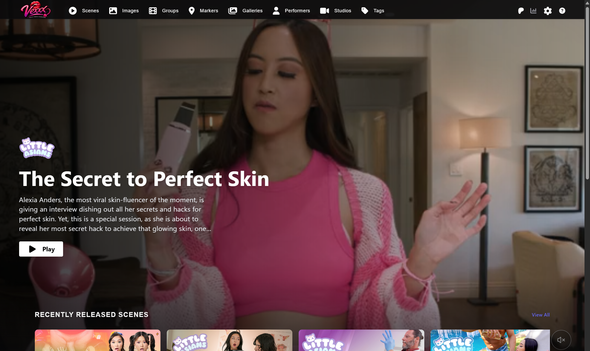

# Vexxx

### A Feature-Enhanced Fork of Stash

[](https://github.com/Serechops/vexxx-stash/actions/workflows/build.yml)
[](https://discord.gg/2TsNFKt)
[](https://github.com/Serechops/vexxx-stash/releases/latest)

**Vexxx is a fork of [Stash](https://github.com/stashapp/stash) with significant UI/UX improvements, performance optimizations, and powerful new features for managing your media collection.**



---

## ✨ What's New in Vexxx

Vexxx builds on Stash's solid foundation with a modernized interface and features designed for power users.

### 🎨 Complete UI Overhaul

- **React-Bootstrap → MUI v7**: Full migration to Material UI for a modern, consistent design language
- **Premium Experience**: Hero banners and content highlighting inspired by streaming services like Google TV
- **Global Search**: Glassmorphic `Cmd+K` / `Ctrl+K` search modal with rich results grid
  - Keyboard navigation (Arrow keys, Enter)
  - Multi-type results: Scenes, Performers, Images, Galleries, Studios, Tags
  - Debounced input for responsive searching

### ⚡ Enhanced Task System

- **Concurrent Tasks**: Run up to 4 different tasks simultaneously (Generate, Scan, Plugin tasks, etc.)
- **Native Scheduled Tasks**: Built-in cron job scheduling for common operations
  - Scan for new content on a schedule
  - Run plugin tasks automatically
  - Scheduled database backups
  - Custom cron expressions supported

### 🎬 Scene Segments & Virtual Timelines

Create virtual sub-scenes from a single video file without re-encoding:

- Define start/end points to create segment scenes
- Generate previews, scrubber sprites, and phashes for segments
- Segments are treated as full scenes (filterable, groupable, taggable)
- Perfect for multi-scene compilations or extracting highlights
- **Automated Segment Matching**: Fuzzy scan with configurable window/increment to find matches on StashDB via phash

### 🔍 Missing Scenes Detection

Track scenes you don't own directly from Performer and Studio detail pages:

- **StashDB Integration**: Scrape all scenes for a performer or studio from connected StashBoxes
- **Ownership Detection**: Automatically detects when a tracked scene is added to your library
- **Three-State Tracking**: Grey (untracked) → Green (tracked) → Blue (owned)
- **Trailer Previews**: Hover to preview trailers scraped from external sites (AdultTime, Brazzers, RealityKings, etc.)
- **Background Scraping**: Queue scraping jobs that run asynchronously without blocking the UI
- **Client-Side Filtering**: Filter missing scenes by studio, performer, tags, or text search

### 🎬 MovieFy Integration

External database integration for streamlined group/movie management:

- **Database Search**: Query an external MovieFy database for movie metadata
- **Queue Workflow**: Add scenes to a processing queue, edit scene indexes, and batch-create groups
- **Parked Scenes**: Accumulate scenes before processing with merge logic
- **Rich Metadata**: Preserve tags, studios, synopsis, and directors during group creation

### 🏷️ Bulk Tagger Improvements

- **Native Bulk Actions**: Search All, Create All, Save All buttons
- **Mass Query Editor**: Append search terms to all query lines at once instead of one at a time

### 🔗 Enhanced Group-Scene Linking

- **Scene Index Support**: Proper `scene_index` handling for ordered group scenes
- **Instant UI Updates**: Cache eviction for immediate refresh after linking
- **Auto-Increment**: New scenes automatically get the next available index
- **Trailer Support**: Scrape and play trailers from AdultEmpire with HLS proxy for CORS-restricted streams

### 👥 Multi-User Support with Role-Based Access Control

Full multi-user authentication and authorization system:

- **User Roles**: ADMIN (full access) and VIEWER (read-only) roles
- **Admin Capabilities**: Content modifications, system configuration, user management, task execution
- **Viewer Capabilities**: View all content, change own password, regenerate own API key
- **Session Management**: Secure session-based and API key authentication
- **Legacy Migration**: Existing single-user credentials automatically migrated
- **Route Protection**: Admin-only pages (Settings, Renamer, MovieFy, etc.) protected
- **UI Filtering**: Features hidden based on permissions (e.g., Tagger mode for viewers)

### 📁 Advanced File Renamer

Powerful file organization with template-based renaming:

- **Move Files Support**: Physically relocate files to new directories based on metadata
- **Windows Path Handling**: Robust "Shotgun Lookup" for cross-platform path compatibility
- **Token Validation**: Strict validation with clear error messages for missing data
- **Dry-Run Preview**: See all changes before applying with "No changes needed" detection
- **Auto-Rename on Save**: Optionally trigger renaming when scene metadata is updated

### 🎵 Playlist Player Redesign

Complete UI/UX overhaul with Scene.tsx-inspired layout:

- **Split-Panel Layout**: Queue panel (left) + player container (right)
- **Native Video Controls**: HTML5 controls with simplified navigation overlay
- **Queue Panel Features**:
  - Auto-scroll to active item
  - Visual states: active (highlighted), past (dimmed), playing (icon overlay)
  - Media type badges and duration display
  - Previous/Next/Random navigation buttons
  - Auto-play toggle switch
- **Keyboard Shortcuts**: `←`/`→` for navigation, `,` to toggle queue panel
- **Responsive Design**: Column-reverse on mobile, collapsible panel on desktop
- **Lightbox Improvements**: Clean navigation with icon-only hover effects

### 🤖 AI-Powered Features

#### StashFace Performer Identification

- **Smart Frame Selection**: VTT-aware candidate generation for accurate face detection
- **High-Resolution Scanning**: 360px grid previews for improved accuracy
- **Screenshot Scanning**: Use scene cover images for better face detection
- **Multiple Image Search**: Robust endpoint for batch face matching
- **Enhanced Results UI**: Larger avatars (80px), clear confidence scores, improved error messages

#### MegaFace Second Opinion

- **Dual-Engine Identification**: Run both StashFace and MegaFace for cross-validation
- **Tabbed Results**: Compare results from both services side-by-side
- **HTML Results Rendering**: Styled MegaFace output in dedicated container

#### StashTag Scene Tagging

- **Responsive Grid Layout**: 2-column CSS Grid with scrollable results
- **Polished Result Cards**: Shadows, hover effects, confidence-based backgrounds
- **Frame Previews**: 180px preview images with centered confidence chips

#### Intelligent Recommendations

- **Dynamic Weight Tuning**: Real-time sliders for Tags, Performers, and Studio weights
- **Item-to-Item Similarity**: Discover new performers based on your favorites
- **Attribute Matching**: Find performers by physical attributes (hair color, eye color, etc.)
- **StashDB Discovery**: Query StashDB using your top local performers as seeds
- **Match Transparency**: See reasoning and scores for each recommendation

### 🔌 Plugin System Enhancements

- **Automated Dependency Installation**: Pip packages installed automatically during plugin install/update
- **Collision Detection**: Safe requirement handling protects existing environment packages
- **Fallback Import Scanner**: Detects dependencies for plugins missing requirements.txt
- **Python Environment Verification**: Utilities to verify Python setup

### ⚡ Hardware Acceleration

GPU-accelerated video encoding with automatic detection:

- **Supported Encoders**: NVENC (NVIDIA), AMF (AMD), QSV (Intel), VAAPI (Linux), VideoToolbox (macOS)
- **Platform-Aware Detection**: Only tests compatible codecs for your OS
- **UI Indicator**: Green chip in navbar shows detected hardware encoders
- **Task Integration**: Generate Transcodes and preview tasks use GPU when available

### 🚀 Backend Performance Optimizations

**N+1 Query Resolution & Database Indexing**

- Added `GetMany` batch methods to `SceneStore`, `StashIDRepository`, and other repositories
- New DataLoaders for `SceneTags`, `ScenePerformers`, `SceneGalleryIDs`, `SceneStashIDs`
- GraphQL resolvers updated to use DataLoaders, eliminating N+1 database queries
- Strategic indexes added for `stash_id`, `date`, `rating`, `created_at`, `mod_time` on relevant tables

**Query Optimization & Caching**

- Decoupled count and ID retrieval for Gallery, Scene, and Performer queries
- "Fast path" execution for unfiltered queries and optimized sorts (Title, Name, Date)
- Stats caching mechanism for improved dashboard performance
- New SQLite stores for core entities

### 🎨 UI/UX Enhancements

- **Hero Parallax**: Google TV-style fixed-background parallax on the Front Page
- **Skeleton Loading**: Smooth loading states for all media grids (Scenes, Performers, Groups, etc.)
- **Layout Stability**: Fixed jarring layout shifts during pagination
- **Grid Standardization**: Unified column templates and synchronized zoom levels across all media types
- **Theme Alignment**: Synchronized MUI breakpoints with CSS for consistent responsive behavior
- **Semantic Variables**: Shared design tokens for colors and spacing

---

## 📦 Installation

### Docker (Recommended)

```bash
docker pull ghcr.io/serechops/vexxx-stash:latest
docker run -d \
  --name vexxx \
  -p 9999:9999 \
  -v /path/to/config:/root/.stash \
  -v /path/to/media:/data \
  ghcr.io/serechops/vexxx-stash:latest
```

### Manual Installation

Download the latest release for your platform from the [Releases](https://github.com/Serechops/vexxx-stash/releases) page.

| Platform | Download |
|:--------:|:--------:|
| Windows | [stash-win.exe](https://github.com/Serechops/vexxx-stash/releases/latest) |
| macOS | [Stash.app.zip](https://github.com/Serechops/vexxx-stash/releases/latest) |
| Linux | [stash-linux](https://github.com/Serechops/vexxx-stash/releases/latest) |

#### Requirements

- **FFmpeg**: Required for video processing. Vexxx will prompt you to download it on first run, or install via your system package manager.
- **Windows**: Windows 10 or Server 2016+
- **macOS**: macOS 11 Big Sur or later

---

## 🚀 Quick Start

1. Launch Vexxx - the web interface is available at `http://localhost:9999`
2. Complete the setup wizard to configure your media directories
3. Run a scan to index your content
4. Use `Cmd+K` / `Ctrl+K` to search across your entire library

---

## 🔧 Configuration

Vexxx maintains full compatibility with Stash configuration. Your existing Stash database and settings will work seamlessly.

### Scheduled Tasks

Navigate to **Settings → Tasks → Scheduled Tasks** to configure automated jobs:

```
# Example: Scan every day at 2 AM
0 2 * * * scan

# Example: Generate missing content every Sunday
0 3 * * 0 generate
```

---

## 📚 Documentation

- [Stash Documentation](https://docs.stashapp.cc) - Core functionality documentation
- [In-App Manual](https://docs.stashapp.cc/in-app-manual) - Press `Shift+?` in the app

---

## 🌐 Community & Support

- [Discord](https://discord.gg/2TsNFKt) - Real-time chat and community support
- [Stash Community Forum](https://discourse.stashapp.cc) - Community discussions and support

---

## 📜 Credits

Vexxx is built on the excellent foundation of [Stash](https://github.com/stashapp/stash) by the stashapp team. We're grateful for their work and the community they've built.

---

## 📄 License

Vexxx is released under the same license as Stash. See [LICENSE](LICENSE) for details.
